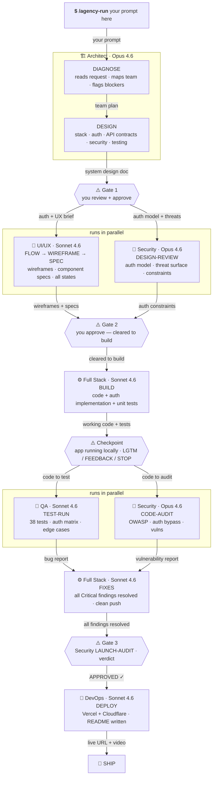

# Navox Agents

> A specialist AI engineering team for Claude Code.
> 7 agents. No platform. No login. Your code never leaves your machine.

[](https://github.com/navox-labs/agents)
[](https://opensource.org/licenses/MIT)
[](https://claude.ai)


---

## See it work first

> We gave the agents one prompt.
> 7 minutes later: a playable crab cookie clicker game.
> 1,330 lines. Zero dependencies. 6 bugs caught by QA.
> [🦀 Play nom.sh →](https://github.com/navox-labs/nom)

---

## Install

If you hit an SSH error, run this first (one time):
```bash
git config --global url."https://github.com/".insteadOf "git@github.com:"
```

Then install:
```
/plugin marketplace add https://github.com/navox-labs/agents
/plugin install navox-agents
/reload-plugins
```

> **Note:** Plugin commands are namespaced. Use `/navox-agents:agency-run` and `/navox-agents:hire-team` instead of `/agency-run` and `/hire-team`. If you installed via the manual copy method below, no namespace is needed.

---

## Alternative: manual install

**Global** — available in every project:
```bash
git clone https://github.com/navox-labs/agents.git
mkdir -p ~/.claude/agents ~/.claude/commands ~/.claude/templates
cp -r agents/.claude/agents/* ~/.claude/agents/
cp -r agents/.claude/commands/* ~/.claude/commands/
cp -r agents/templates/* ~/.claude/templates/
```

**Project only:**
```bash
git clone https://github.com/navox-labs/agents.git /tmp/navox-agents && mkdir -p .claude/agents .claude/commands && cp -r /tmp/navox-agents/.claude/agents/* .claude/agents/ && cp -r /tmp/navox-agents/.claude/commands/* .claude/commands/ && rm -rf /tmp/navox-agents
```

---

## Run your first build

Open Claude Code in any project folder and run:

**If you installed as a plugin:**
```
/navox-agents:agency-run Build a {browser-based} {Cookie Clicker game}
with {Atari pixel art} vibes where {crabs eat cookies}.
No authentication. No backend. Single HTML file,
runs in any browser. Make it {addictive} and {funny}.
```

**If you installed manually (copy method):**
```
/agency-run Build a {browser-based} {Cookie Clicker game}
with {Atari pixel art} vibes where {crabs eat cookies}.
No authentication. No backend. Single HTML file,
runs in any browser. Make it {addictive} and {funny}.
```

Replace the `{variables}` with your own idea.
This is exactly how we built [nom.sh](https://github.com/navox-labs/nom) in 7 minutes.

---

## How it works



---

## The team

| | Agent | What they do |
|---|---|---|
| 🏗️ | **Architect** | Designs the system. Picks the stack. Defines auth. |
| 🎨 | **UI/UX** | Maps user flows. Specs every screen and state. |
| ⚙️ | **Full Stack** | Builds it. Tests it. Ships clean code. |
| 🚀 | **DevOps** | CI/CD. Docker. Deploys. Secrets never touch code. |
| 🧪 | **QA** | Finds every bug. Auth flows get extra scrutiny. |
| 🔐 | **Security** | Audits everything. Nothing launches without a verdict. |

Use one agent directly: `/architect DIAGNOSE`, `/security LAUNCH-AUDIT`, `/qa PLAN`
(Plugin users: prefix with `navox-agents:` e.g. `/navox-agents:architect DIAGNOSE`)

---

## You stay in control

1. Agents pause at every gate and wait for your approval
2. Nothing destructive runs without your explicit sign-off
3. You can redirect, reject, or stop at any point

> Agents stop. They wait. You decide. Then they continue.

Full guide: [docs/hitl.md](docs/hitl.md)

---

## Start faster

First time using Navox Agents on a new project?
Tell the agents your stack once — they'll know it every session.

After installing the agents globally, run this from inside your project folder:

```bash
cp ~/.claude/templates/nextjs.CLAUDE.md ./CLAUDE.md          # Next.js + Vercel
cp ~/.claude/templates/node-api.CLAUDE.md ./CLAUDE.md        # Node.js + Express
cp ~/.claude/templates/rails.CLAUDE.md ./CLAUDE.md           # Rails 8
cp ~/.claude/templates/python-fastapi.CLAUDE.md ./CLAUDE.md  # Python + FastAPI
cp ~/.claude/templates/cloudflare-workers.CLAUDE.md ./CLAUDE.md  # Cloudflare Workers
```

Pick one. The agents read it automatically when Claude Code opens.

---

## What this is not

- Not a platform. No dashboard, no login.
- Not a SaaS. No subscription, no usage limit.
- Not a plugin. Nothing to configure in your editor.
- Not storing your data. Everything runs locally through Claude Code.
- Not autonomous. You stay in the loop.

---

[📖 Docs](docs/) · [⚡ Install](docs/install.md) · [🦀 See it work](https://github.com/navox-labs/nom) · [🐛 Report Bug](https://github.com/navox-labs/agents/issues)

Built by [Navox Labs](https://navox.tech) · MIT License
