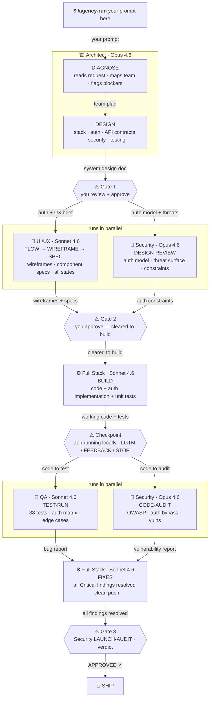

# Navox Agents

> A specialist AI engineering team for Claude Code.
> 6 agents. No platform. No login. Your code never leaves your machine.

[](https://github.com/navox-labs/agents)
[](https://opensource.org/licenses/MIT)
[](https://claude.ai)

---

## See it work first

> We gave the agents one prompt.
> 7 minutes later: a playable crab cookie clicker game.
> 1,330 lines. Zero dependencies. 6 bugs caught by QA.
> [🦀 Play nom.sh →](https://github.com/navox-labs/nom)


---

## Install

**Global** — available in every project:
```bash
git clone https://github.com/navox-labs/agents.git
cp -r agents/.claude/agents/* ~/.claude/agents/
cp -r agents/.claude/commands/* ~/.claude/commands/
```

**Project only:**
```bash
cp -r agents/.claude/agents/* .claude/agents/
cp -r agents/.claude/commands/* .claude/commands/
```

---

## Run your first build

Open Claude Code in any project folder and run:

```
/agency-run Build a SaaS app with user auth, team billing, and an admin dashboard
```

That's it. The full team runs automatically.

---

## The team

| | Agent | What they do |
|---|---|---|
| 🏗️ | **Architect** | Designs the system. Picks the stack. Defines auth. |
| 🎨 | **UI/UX** | Maps user flows. Specs every screen and state. |
| ⚙️ | **Full Stack** | Builds it. Tests it. Ships clean code. |
| 🚀 | **DevOps** | CI/CD. Docker. Deploys. Secrets never touch code. |
| 🧪 | **QA** | Finds every bug. Auth flows get extra scrutiny. |
| 🔐 | **Security** | Audits everything. Nothing launches without a verdict. |

Use one agent directly: `architect DIAGNOSE`, `security LAUNCH-AUDIT`, `qa PLAN`

---

## How it works



---

## You stay in control

1. Agents pause at every gate and wait for your approval
2. Nothing destructive runs without your explicit sign-off
3. You can redirect, reject, or stop at any point

Full guide: [docs/hitl.md](docs/hitl.md)

---

## Stack templates

Drop a pre-built `CLAUDE.md` into your project so agents know your stack immediately:

```bash
cp templates/nextjs.CLAUDE.md your-project/CLAUDE.md     # Next.js 15 + Prisma + Supabase Auth
cp templates/node-api.CLAUDE.md your-project/CLAUDE.md    # Express + JWT + Redis + Railway
cp templates/rails.CLAUDE.md your-project/CLAUDE.md       # Rails 8 + Devise + Sidekiq + Render
```

---

## What this is not

- Not a platform. No dashboard, no login.
- Not a SaaS. No subscription, no usage limit.
- Not a plugin. Nothing to configure in your editor.
- Not storing your data. Everything runs locally through Claude Code.
- Not autonomous. You stay in the loop.

---

[📖 Docs](docs/) · [⚡ Install](docs/install.md) · [🦀 See it work](https://github.com/navox-labs/nom) · [🐛 Report Bug](https://github.com/navox-labs/agents/issues)

Built by [Navox Labs](https://navox.tech) · MIT License
