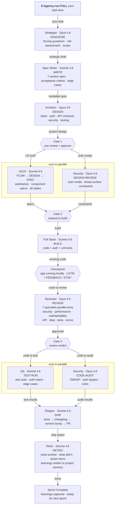

# Navox Agents

> 15 AI specialists. One sprint cycle. Zero dependencies.
> Think. Plan. Build. Review. Test. Ship. Reflect.

[](https://github.com/navox-labs/agents)
[](https://opensource.org/licenses/MIT)
[](https://claude.ai)
[](https://github.com/marketplace/actions/github-traffic-agent)


A Claude Code plugin **and** a Python CLI for autonomous orchestration. Install the plugin for interactive sprints. Use the SDK to run your team while you sleep.

---

## Why I built this

When I heard AI will replace engineers, I wanted to find out how. Not in theory — in practice. How does a non-human replace humans in an engineering capacity?

I'm Nahrin, founder and builder at Navox Labs. Earlier in my life I worked in building architecture — reviewing blueprints, designing structures, making sure everything held together before a single brick was laid. I'm the only architect I know who transitioned to full-time software engineering without a formal CS education. I told myself: once an architect, always an architect. I understood tech through a builder's lens — scalability, optimization, reliable structure.

I've been building physical products for 16 years and tech products for 7. Twenty-three years of building, and I never thought AI could replace my ability to make decisions. It can't. But it can execute them.

Navox Agents is how I ship.

As a solo founder, I needed a reliable team that requires minimum management. Not a chatbot I have to babysit. Not a prompt I cross my fingers on. A team of specialists with defined roles, handoff contracts, quality gates, and the discipline to self-evaluate before passing work downstream.

I believe a single builder with the right tooling can move faster than a traditional team. This is my answer.

Fully open source. A Claude Code plugin for interactive sprints **and** a Python CLI for autonomous orchestration. I combined these two because I want this to reach as many people as possible. These agents are built with best practices from Anthropic themselves. They self-evaluate for high reliability. They're orchestrated and work exactly like a team of specialists.

This is an open-source software factory. I use it every day. I'm sharing it because these tools should be available to everyone.

Fork it. Improve it. Make it yours.

And if you want to hate on free open-source software — you're welcome to, but I'd rather you just try it first.

---

## Who is this for

**Founders and CEOs** — especially technical ones who still want to ship. Run a full sprint while you focus on strategy, fundraising, or sleep.

**First-time Claude Code users** — structured roles instead of a blank prompt. Instead of figuring out what to ask Claude, just tell the team what to build.

**Tech leads and staff engineers** — orchestrated specialist agents that follow your architecture decisions, not fight them. Sprint chains enforce the same discipline you'd expect from a senior team.

**Solo builders** — one person, 15 specialists. The math works.

---

## See it work

**nom.sh — one prompt, 7 minutes:**
> A crab cookie clicker. 1,330 lines. 6 bugs caught by QA. Zero human edits.
> [See the code](https://github.com/navox-labs/nom)

**PipeWar — built, debugged, and deployed by agents:**
> A Factorio-inspired tower defense game. Built from scratch, 8 production bugs diagnosed and fixed, 65 tests passing. All by the agent team.
> [See the code](https://github.com/navox-labs/pipewar)

---

## Install as a Claude Code plugin

If you hit an SSH error, run this first (one time):
```bash
git config --global url."https://github.com/".insteadOf "git@github.com:"
```

Then install:
```
/plugin marketplace add https://github.com/navox-labs/agents
/plugin install navox-agents
/reload-plugins
```

> If this saves you time, [star the repo](https://github.com/navox-labs/agents) — it helps others find it.

> **Note:** Plugin commands are namespaced. Use `/navox-agents:agency-run` and `/navox-agents:hire-team` instead of `/agency-run` and `/hire-team`. If you installed via the manual method below, no namespace is needed.

---

## Alternative: manual install (for customization)

```bash
git clone https://github.com/navox-labs/agents.git
cd agents
bash scripts/setup.sh
```

Options:
```bash
bash scripts/setup.sh --global             # Install to home directory (all projects)
bash scripts/setup.sh --agents strategist,reviewer  # Install specific agents only
bash scripts/setup.sh --list               # See all available agents
```

Or copy manually:
```bash
mkdir -p ~/.claude/agents ~/.claude/commands
cp -r .claude/agents/* ~/.claude/agents/
cp -r .claude/commands/* ~/.claude/commands/
cp ETHOS.md ~/.claude/ETHOS.md
```

---

## The sprint

Three modes. Pick one based on what you need.

### Full sprint — idea to shipped PR with retrospective

```
/agency-run FULL Build a {browser-based} {Cookie Clicker game}
with {Atari pixel art} vibes where {crabs eat cookies}.
No authentication. No backend. Single HTML file.
```

**Strategist** challenges your assumptions. **Spec Writer** turns it into a buildable spec. **Architect** designs the system. **UX** maps every screen. **Security** audits the design. **Full Stack** builds it. **Local Review** shows it to you. **Reviewer** runs a 7-specialist army over the code. **QA** finds every edge case. **Security** audits the code. **Shipper** creates the PR. **Retro** captures what the team learned.

### Quick sprint — skip strategy, get to code faster

```
/agency-run QUICK Add a {dark mode toggle} to the settings page
```

### Hotfix — bug to fix to ship

```
/agency-run HOTFIX Users get 403 errors after login on mobile Safari
```

---

## Power tools — use agents directly

| What you need | Command |
|---|---|
| Validate an idea | `/strategist DIAGNOSE` |
| Write a spec | `/spec-writer WRITE` |
| System design | `/architect DESIGN` |
| Debug a bug | `/investigator INVESTIGATE` |
| Build a feature | `/fullstack BUILD` |
| Review code | `/reviewer REVIEW` |
| Security audit | `/security CODE-AUDIT` |
| Ship a release | `/shipper SHIP` |
| Run a retro | `/retro RETRO` |
| Save context | `/context-manager SAVE` |
| See all modes | [docs/modes.md](docs/modes.md) |

Replace the `{variables}` with your own idea.
Plugin users: prefix with `navox-agents:` (e.g. `/navox-agents:strategist DIAGNOSE`)

---

## How it works — FULL Sprint



---

## The team

| Agent | What they do |
|---|---|
| **Strategist** | Challenges assumptions. Asks forcing questions. No sycophancy. |
| **Spec Writer** | Turns vague ideas into precise, testable specifications. |
| **Architect** | Designs the system. Picks the stack. Defines auth. |
| **UI/UX** | Maps user flows. Specs every screen and state. |
| **Full Stack** | Builds it. Tests it. Ships clean code. |
| **Investigator** | Root-cause debugging. No fixes without diagnosis. |
| **Reviewer** | 7-specialist parallel review army. |
| **DevOps** | CI/CD. Docker. Deploys. Secrets never touch code. |
| **Local Review** | Starts the app. Shows it to you. Waits for your go. |
| **QA** | Finds every bug. Auth flows get extra scrutiny. |
| **Security** | OWASP + STRIDE audits. Nothing launches without a verdict. |
| **Shipper** | Tests, changelog, version bump, PR. The last mile. |
| **Retro** | Sprint retrospectives. Learnings compound over time. |
| **Context Manager** | Session persistence. Pause any sprint, resume later. |
| **Installer** | Helps you discover and install individual agents. |

---

## Navox Agents vs gstack

[gstack](https://github.com/garrytan/gstack) (108K stars) is a great project — 23 workflow skills with a Bun+Chromium runtime. Different philosophy, different trade-offs.

| | **Navox Agents** | **gstack** |
|---|---|---|
| **Architecture** | 15 specialist agents with defined roles, handoff contracts, and sprint chains | 23 workflow skills, each independent |
| **Orchestration** | Full sprint chains — agents hand off to each other in sequence with parallel groups | No inter-skill orchestration — each skill runs standalone |
| **Reliability model** | Eval-gated retries (8/10 threshold), self-validation checklists, handoff contract enforcement | Confusion Protocol stops guessing, but no automated quality gates between steps |
| **Quality assurance** | 10-point rubric scoring, 383 validation checks, 91 SDK tests, deterministic eval after every step | Manual review points, no automated scoring |
| **Autonomy** | Python SDK runs full sprints while you sleep — journaled, resumable, parallel | Interactive — requires human presence for each skill |
| **Dependencies** | Zero. Markdown prompts + optional Python SDK | Bun runtime, Chromium, npm packages |
| **Failure handling** | Upstream agent fails → downstream flags missing input before starting. One agent crash doesn't kill the chain. | Individual skill failure stops that skill |
| **Memory** | Per-agent memory + shared project memory, persists across sprints | Session-based context |
| **Anti-sycophancy** | Structurally enforced — Strategist and Reviewer have explicit anti-agreement rules in their prompts | Office hours format encourages honest feedback |
| **Install** | `git clone` or Claude Code plugin marketplace | `npx gstack` |

**Where gstack wins:** larger community, browser-based visual tools, faster single-skill execution.

**Where Navox wins:** multi-agent orchestration with handoff contracts, automated quality gates, autonomous operation via SDK, zero dependencies, and the reliability guarantees that come from agents validating each other's work before passing it downstream.

The core difference: gstack gives you 23 independent tools. Navox gives you a team that works together.

---

## Handoff contracts

Every agent has a **handoff contract** — a defined set of required sections it must include in its output before passing work to the next agent. Agents self-validate against their contract before completing.

This means:
- The **Architect** must include API contracts, auth model, and build order — not just a prose summary
- **Full Stack** must include a file manifest and run instructions — not just "I built it"
- **Security** must reference specific file paths and severity levels — not general advice
- **QA** must include exact pass/fail counts and reproduction steps — not approximations

If an upstream agent omits a required section, the downstream agent flags it before starting work. No agent guesses at what it should have received.

Full contract details: [docs/handoff-chain.md](docs/handoff-chain.md)

---

## Builder philosophy

Every agent is guided by three principles from [ETHOS.md](ETHOS.md):

1. **Do the Complete Thing** — no half-done work, no skipped edge cases
2. **Investigate Before Acting** — understand what exists before changing it
3. **Builder Sovereignty** — AI recommends, humans decide. Always.

These aren't decorative. They're enforced in every agent's prompt and checked by the eval system.

---

## You stay in control

1. Agents pause at every gate and wait for your approval
2. Nothing destructive runs without your explicit sign-off
3. You can redirect, reject, or stop at any point

> Agents stop. They wait. You decide. Then they continue.

Full guide: [docs/hitl.md](docs/hitl.md)

---

## Project memory

After each `/agency-run`, the team writes down what it learned in `.claude/project-memory.md`. Next run, it reads this file first — so it won't repeat work or ask you to re-explain the stack.

| Section | Update rule | Purpose |
|---|---|---|
| **Current State** | Overwritten each run | What's true right now — stack, status, live URL |
| **Active Decisions** | Add new, remove resolved | Open questions that still need answers |
| **History** | Prepend, never delete | What happened in each run (audit trail) |

Each agent also keeps its own memory in `.claude/memory/[agent].md` with the same structure.

---

## SDK — autonomous orchestration

The `sdk/` directory contains a Python orchestration engine that runs sprint chains autonomously via the Anthropic API. Every agent step is evaluated against an 8/10 quality threshold — outputs below the bar are automatically retried with feedback.

```bash
cd sdk && pip install -e .

# Dry run — validate the chain without API calls
navox run full "Build an invoicing app" --dry-run

# Run a full sprint autonomously
navox run full "Build an invoicing app"

# Quick sprint or hotfix
navox run quick "Add dark mode toggle"
navox run hotfix "Fix 403 errors after login"

# Check journal status (resumable — interrupted sprints resume automatically)
navox status
```

Features:
- **Eval-gated retries** — deterministic grading after each step (8/10 threshold), auto-retry with feedback
- **Content-addressed journaling** — same task resumes from where it left off
- **Parallel execution** — agents in the same group run concurrently with failure containment
- **Stop reason handling** — all 6 Anthropic API stop reasons handled (end_turn, max_tokens, refusal, etc.)

---

## Quality assurance

Every agent scores **10/10** against a quality rubric covering: frontmatter, modes, handoff contracts, anti-hallucination rules, anti-sycophancy, error handling, structured output, scope boundaries, ethos reference, and memory integration.

**Validation** — 383 checks across all agents, contracts, and registry:
```bash
bash scripts/validate.sh    # Structural checks
navox validate              # Full validation (Python)
navox score                 # 10-point rubric scoring
```

**SDK tests** — 91 tests covering orchestrator, journal, eval, validators, and contracts:
```bash
cd sdk && python -m pytest tests/ -q
```

---

## What this is not

- Not a platform. No dashboard, no login.
- Not a SaaS. No subscription, no usage limit.
- Not a walled garden. The source is open — fork it, customize the prompts, make it yours.
- Not storing your data. Everything runs locally through Claude Code.
- Not black-box autonomous. The SDK runs autonomously but every step is evaluated, journaled, and resumable.

---

## More from Navox Labs

| Project | What it does |
|---|---|
| [GitHub Traffic Agent](https://github.com/navox-labs/github-traffic-agent) | AI-powered GitHub Action that collects traffic data daily, analyzes trends, and sends Claude-powered briefs to Slack. Solves the 14-day retention limit. |
| [nom.sh](https://github.com/navox-labs/nom) | A crab cookie clicker — built entirely by Navox Agents in 7 minutes, zero human edits. |
| [PipeWar](https://github.com/navox-labs/pipewar) | Factorio-inspired tower defense game — built, debugged, and deployed by the agent team. |

---

[Docs](docs/) · [Install](docs/install.md) · [See it work](https://github.com/navox-labs/nom) · [Report Bug](https://github.com/navox-labs/agents/issues)

Built by [Nahrin](https://github.com/nicemid) at [Navox Labs](https://navox.tech) · MIT License
