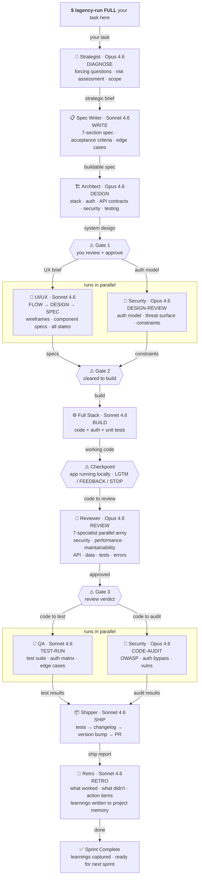

# Navox Agents

> A 15-agent AI engineering team that covers the full sprint cycle.
> Think. Plan. Build. Review. Test. Ship. Reflect. Zero dependencies.

[](https://github.com/navox-labs/agents)
[](https://opensource.org/licenses/MIT)
[](https://claude.ai)


---

## See it work

**nom.sh — one prompt, 7 minutes:**
> 🦀 A crab cookie clicker. 1,330 lines. 6 bugs caught by QA.
> [See the code →](https://github.com/navox-labs/nom)

**PipeWar — built, debugged, and deployed by agents:**
> 🛡️ A Factorio-inspired tower defense game. Built from scratch, 8 production bugs diagnosed and fixed, 65 tests passing. All by the agent team.
> [Play PipeWar →](https://frontend-beta-five-83.vercel.app) · [See the code →](https://github.com/navox-labs/pipewar)

---

## Install as a Claude Code plugin

Navox Agents is available on Claude Code's plugin marketplace. This is the fastest way to get started — no cloning, no copying files.

If you hit an SSH error, run this first (one time):
```bash
git config --global url."https://github.com/".insteadOf "git@github.com:"
```

Then install:
```
/plugin marketplace add https://github.com/navox-labs/agents
/plugin install navox-agents
/reload-plugins
```

> If this saves you time, [⭐ star the repo](https://github.com/navox-labs/agents) — it helps others find it.

> **Note:** Plugin commands are namespaced. Use `/navox-agents:agency-run` and `/navox-agents:hire-team` instead of `/agency-run` and `/hire-team`. If you installed via the manual copy method below, no namespace is needed.

---

## Alternative: manual install (for customization)

```bash
git clone https://github.com/navox-labs/agents.git
cd agents
bash scripts/setup.sh
```

The setup script supports multiple platforms and options:

```bash
bash scripts/setup.sh --platform claude    # Claude Code (default)
bash scripts/setup.sh --platform cursor    # Cursor
bash scripts/setup.sh --platform copilot   # Copilot CLI
bash scripts/setup.sh --platform codex     # Codex

bash scripts/setup.sh --global             # Install to home directory (all projects)
bash scripts/setup.sh --agents strategist,reviewer  # Install specific agents only
bash scripts/setup.sh --list               # See all available agents
```

Or copy manually:
```bash
mkdir -p ~/.claude/agents ~/.claude/commands ~/.claude/templates
cp -r .claude/agents/* ~/.claude/agents/
cp -r .claude/commands/* ~/.claude/commands/
cp -r templates/* ~/.claude/templates/
cp ETHOS.md ~/.claude/ETHOS.md
```

---

## Run your first build

Open Claude Code in any project folder and run:

**Full sprint** (idea → shipped PR with retrospective):
```
/agency-run FULL Build a {browser-based} {Cookie Clicker game}
with {Atari pixel art} vibes where {crabs eat cookies}.
No authentication. No backend. Single HTML file.
```

**Quick sprint** (skip strategy + review, get to code faster):
```
/agency-run QUICK Add a {dark mode toggle} to the settings page
```

**Hotfix** (bug → root cause → fix → ship):
```
/agency-run HOTFIX Users get 403 errors after login on mobile Safari
```

**Or use agents individually:**
```
/strategist DIAGNOSE I want to build a SaaS for {dog walkers}
/investigator INVESTIGATE The checkout flow breaks on step 3
/reviewer REVIEW
```

Replace the `{variables}` with your own idea.
Plugin users: prefix with `navox-agents:` (e.g. `/navox-agents:agency-run FULL ...`)

---

## How it works — FULL Sprint



---

## The team

| | Agent | What they do |
|---|---|---|
| 🧠 | **Strategist** | Challenges assumptions. Asks forcing questions. No sycophancy. |
| 📋 | **Spec Writer** | Turns vague ideas into precise, testable specifications. |
| 🏗️ | **Architect** | Designs the system. Picks the stack. Defines auth. |
| 🎨 | **UI/UX** | Maps user flows. Specs every screen and state. |
| ⚙️ | **Full Stack** | Builds it. Tests it. Ships clean code. |
| 🔍 | **Investigator** | Root-cause debugging. No fixes without diagnosis. |
| 📝 | **Reviewer** | 7-specialist parallel review army. |
| 🚀 | **DevOps** | CI/CD. Docker. Deploys. Secrets never touch code. |
| 👁️ | **Local Review** | Starts the app. Shows it to you. Waits for your go. |
| 🧪 | **QA** | Finds every bug. Auth flows get extra scrutiny. |
| 🔐 | **Security** | OWASP + STRIDE audits. Nothing launches without a verdict. |
| 📦 | **Shipper** | Tests, changelog, version bump, PR. The last mile. |
| 🔄 | **Retro** | Sprint retrospectives. Learnings compound over time. |
| 💾 | **Context Manager** | Session persistence. Pause any sprint, resume later. |
| 🛠️ | **Installer** | Helps you discover and install individual agents. |

Use one agent directly: `/strategist DIAGNOSE`, `/architect DESIGN`, `/investigator INVESTIGATE`
(Plugin users: prefix with `navox-agents:` e.g. `/navox-agents:strategist DIAGNOSE`)

---

## Handoff contracts

Every agent has a **handoff contract** — a defined set of required sections it must include in its output before passing work to the next agent. Agents self-validate against their contract before completing.

This means:
- The **Architect** must include API contracts, auth model, and build order — not just a prose summary
- **Fullstack** must include a file manifest and run instructions — not just "I built it"
- **Security** must reference specific file paths and severity levels — not general advice
- **QA** must include exact pass/fail counts and reproduction steps — not approximations

If an upstream agent omits a required section, the downstream agent flags it before starting work. No agent guesses at what it should have received.

Full contract details: [docs/handoff-chain.md](docs/handoff-chain.md)

---

## Sprint modes

Three ways to run the team, depending on what you need:

| Mode | Command | What it runs |
|---|---|---|
| **Full Sprint** | `/agency-run FULL <task>` | Think → Plan → Build → Review → Test → Ship → Reflect |
| **Quick Sprint** | `/agency-run QUICK <task>` | Plan → Build → Test → Ship |
| **Hotfix** | `/agency-run HOTFIX <task>` | Investigate → Build → Ship |

## Quick commands

| What you need | Command |
|---|---|
| Validate an idea | `/strategist DIAGNOSE` |
| Write a spec | `/spec-writer WRITE` |
| System design | `/architect DESIGN` |
| Debug a bug | `/investigator INVESTIGATE` |
| Build a feature | `/fullstack BUILD` |
| Review code | `/reviewer REVIEW` |
| Ship a release | `/shipper SHIP` |
| Run a retro | `/retro RETRO` |
| Save context | `/context-manager SAVE` |
| Run the whole team | `/agency-run FULL your task here` |
| See all modes | [docs/modes.md](docs/modes.md) |

Plugin users: prefix commands with `navox-agents:` (e.g. `/navox-agents:strategist DIAGNOSE`)

---

## Builder philosophy

Every agent is guided by three principles from [ETHOS.md](ETHOS.md):

1. **Do the Complete Thing** — no half-done work, no skipped edge cases
2. **Investigate Before Acting** — understand what exists before changing it
3. **Builder Sovereignty** — AI recommends, humans decide. Always.

These aren't decorative. They're enforced in every agent's prompt and checked by the eval system.

---

## Multi-platform support

Works on 4 platforms. Zero dependencies on all of them.

| Platform | Install command |
|---|---|
| **Claude Code** | `bash scripts/setup.sh --platform claude` |
| **Cursor** | `bash scripts/setup.sh --platform cursor` |
| **Copilot CLI** | `bash scripts/setup.sh --platform copilot` |
| **Codex** | `bash scripts/setup.sh --platform codex` |

---

## You stay in control

1. Agents pause at every gate and wait for your approval
2. Nothing destructive runs without your explicit sign-off
3. You can redirect, reject, or stop at any point

> Agents stop. They wait. You decide. Then they continue.

Full guide: [docs/hitl.md](docs/hitl.md)

---

## Project memory

After each `/agency-run`, the team writes down what it learned in `.claude/project-memory.md`. Next run, it reads this file first — so it won't repeat work or ask you to re-explain the stack.

Memory is structured into three sections:

| Section | Update rule | Purpose |
|---|---|---|
| **Current State** | Overwritten each run | What's true right now — stack, status, live URL |
| **Active Decisions** | Add new, remove resolved | Open questions that still need answers |
| **History** | Prepend, never delete | What happened in each run (audit trail) |

Each agent also keeps its own memory in `.claude/memory/[agent].md` with the same structure. Old history entries are automatically summarized to prevent unbounded growth.

---

## Start faster

First time using Navox Agents on a new project?
Tell the agents your stack once — they'll know it every session.

After installing the agents globally, run this from inside your project folder:

```bash
cp ~/.claude/templates/nextjs.CLAUDE.md ./CLAUDE.md          # Next.js + Vercel
cp ~/.claude/templates/node-api.CLAUDE.md ./CLAUDE.md        # Node.js + Express
cp ~/.claude/templates/rails.CLAUDE.md ./CLAUDE.md           # Rails 8
cp ~/.claude/templates/python-fastapi.CLAUDE.md ./CLAUDE.md  # Python + FastAPI
cp ~/.claude/templates/cloudflare-workers.CLAUDE.md ./CLAUDE.md  # Cloudflare Workers
```

Pick one. The agents read it automatically when Claude Code opens.

---

## Quality assurance

Two validation tools keep the agents sharp:

**Repo integrity** — structural checks across all files:
```bash
bash scripts/validate.sh
```

**Agent quality eval** — scores each agent 0-10 against a rubric (frontmatter, modes, handoff contracts, anti-hallucination, memory integration, and more):
```bash
bash scripts/eval.sh
```

Minimum passing score: 8/10. All 14 scored agents currently pass.

---

## What this is not

- Not a platform. No dashboard, no login.
- Not a SaaS. No subscription, no usage limit.
- Not a walled garden. It's a plugin, but the source is open — fork it, customize the prompts, make it yours.
- Not storing your data. Everything runs locally through Claude Code.
- Not autonomous. You stay in the loop.

---

[📖 Docs](docs/) · [⚡ Install](docs/install.md) · [🦀 See it work](https://github.com/navox-labs/nom) · [🐛 Report Bug](https://github.com/navox-labs/agents/issues)

Built by [Navox Labs](https://navox.tech) · MIT License
